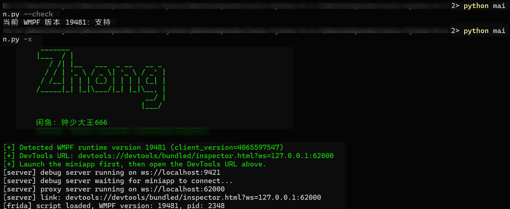
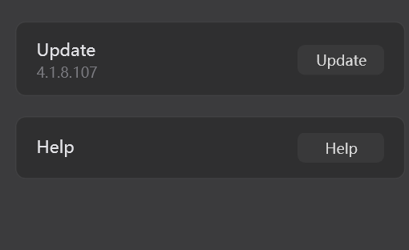
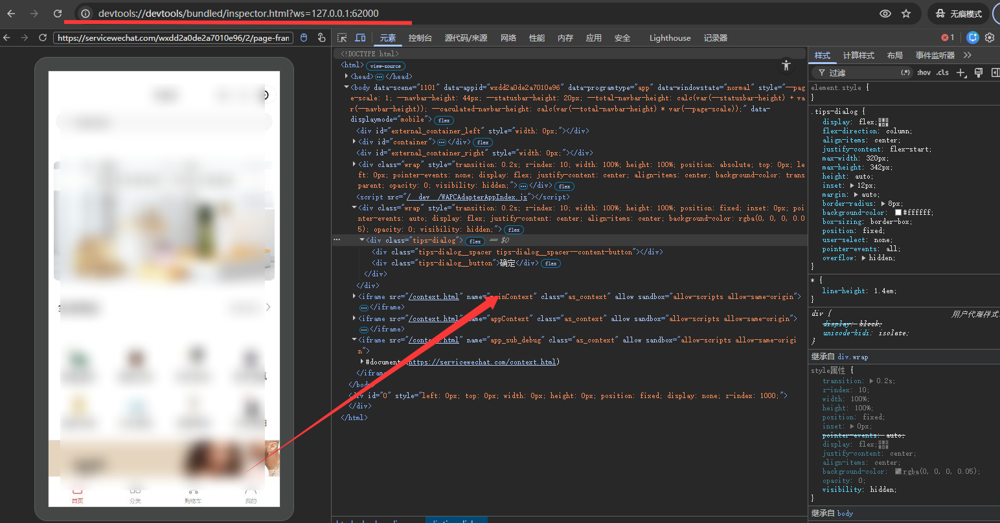

# Zhong 微信小程序强开 F12 工具

[English](README.md)

> ## ⚠️ 下载须知（重要）
>
> **请到 [Releases](https://github.com/netz888/zhong-wechat-wmpf-debugger/releases) 下载打包好的 `zhong-wechat-wmpf-debugger-v*.zip`，不要直接点 “Source code (zip)”。**
>
> 因为 frida 的预编译二进制（约 114MB）超过 GitHub 单文件限制，无法放进源码树。直接下载 Source code 会**缺少预编译文件**，运行时报 `Cannot find module '...frida/build/src/frida.js'`。
>
> 如果你坚持使用 Source code，需要自己补依赖：`cd vendor/wmpfdebugger && npm install`（会自动下载 frida 预编译二进制）。

这是一个面向 Windows 微信小程序运行时的 **强开 F12 调试工具**。  
它同时保留了旧版 Python/Frida 调试路径，并对较新的 WMPF `4.x` 运行时提供本地桥接调试方案。



## 简介

这个项目的目标很直接：

- 检测当前微信小程序运行时版本
- 判断当前运行时是否已经内置支持
- 对新版 WMPF 运行时启动本地调试桥接
- 尽量让微信小程序在桌面端也能像“强开 F12”一样进入调试

## 当前已验证版本

当前已验证支持：

- 微信 `4.1.10`
- WMPF `19895`


官方下载入口：

- <https://pc.weixin.qq.com/>

说明：

- 微信官方安装包**不随仓库分发**
- 是否受支持，最终取决于检测到的 `RadiumWMPF/<版本号>`，而不只是微信主程序显示的版本号

## 核心亮点

- `python main.py --check` 一行判断当前版本是否支持
- `python main.py -x` 一键启动小程序调试
- 已处理新版 WMPF 运行时的重连恢复问题
- 当前已验证支持最新测试版本 `4.1.10 / 19895`

## 环境要求

- Windows 64 位
- Python 3.10+（必须使用 64 位 CPython，不要使用 Python 3.8 或更低版本）
- Node.js
- 已经能正常打开微信小程序

建议在 Windows PowerShell 中这样安装 Python 依赖，避免 `pip` 指向旧 Python：

```powershell
py -3 -c "import sys, platform; print(sys.version); print(platform.architecture()[0])"
py -3 -m venv .venv
.\.venv\Scripts\python -m pip install -U pip
.\.venv\Scripts\python -m pip install -r requirements.txt
```

如果第一行输出不是 Python 3.10+ 和 `64bit`，先安装 64 位 Python 3.10+，再重新创建虚拟环境。

如果你已经在虚拟环境里，也请优先使用：

```powershell
python -m pip install -r requirements.txt
```

不要直接依赖全局的 `pip` 命令；它可能绑定到旧版 Python。

如果安装时报：

```text
No matching distribution found for pyfiglet==1.0.2
```

通常是当前 Python 版本低于要求。先检查：

```powershell
python -c "import sys, platform; print(sys.version); print(platform.architecture()[0])"
where python
where pip
```

确认输出是 Python 3.10+ 且 `64bit`。如果 `frida` 下载的是 `.tar.gz` 源码包而不是 `win_amd64.whl`，也通常说明你正在使用 32 位或不匹配的 Python。安装 64 位 Python 3.10+ 后重新创建虚拟环境再安装。

如果确认 Python 没问题但镜像源缺包，可以临时使用官方 PyPI：

```powershell
.\.venv\Scripts\python -m pip install -r requirements.txt -i https://pypi.org/simple
```

## 快速开始

### 第 1 步：先检查当前运行时是否支持

```bash
python main.py --check
```

示例输出：

```text
当前 WMPF 版本 19895：支持
```

### 第 2 步：启动调试脚本

```bash
python main.py -x
```

启动成功后，脚本会输出一个 `devtools://...` 调试链接。

### 第 3 步：打开微信里的目标小程序

推荐顺序是：

1. 先打开脚本
2. 再打开微信里的目标小程序
3. 等小程序页面实际加载出来
4. 再去浏览器里打开脚本输出的 `devtools://...` 链接

### 第 4 步：在浏览器中打开调试页面

你会看到类似这样的链接：

```text
devtools://devtools/bundled/inspector.html?ws=127.0.0.1:62000
```

把它复制到 Chromium 系浏览器里打开即可。


## 详细操作顺序

如果你是第一次使用，建议严格按下面顺序来：

1. 运行：
   ```bash
   python main.py --check
   ```
   先确认当前版本支持

2. 再运行：
   ```bash
   python main.py -x
   ```

3. 等终端里出现：
   - `Detected WMPF runtime version ...`
   - `DevTools URL: ...`
   - `[server] debug server running ...`

4. 然后打开微信里的目标小程序

5. 最后再打开浏览器调试页面

## 如果打开网页后没有进入调试怎么办

如果浏览器页面打开了，但没有显示当前小程序调试内容，按这个顺序排查：

1. 先确认小程序已经在微信里打开，并且页面已经加载出来
2. 刷新浏览器里的 DevTools 页面一次
3. 如果还是没有进入调试，关闭这个 DevTools 标签页，再重新打开终端里输出的链接
4. 如果还是不行，关闭当前脚本进程后重新运行：
   ```bash
   python main.py -x
   ```

## 常用命令

- `python main.py --check`
  检查当前微信运行时是否已内置支持
- `python main.py -x`
  启动小程序调试流程
- `python main.py -x --debug`
  启动并输出详细调试日志（Frida hook 输出 + 桥接日志，适合排查新 WMPF 版本问题）
- `python main.py -c`
  启动内置浏览器调试流程
- `python main.py -all`
  同时执行两种流程

## 网络面板只显示少量请求

DevTools 网络面板只能捕获**调试器连接之后**发出的请求。连接前已经完成的图片、CSS、JS 加载不会出现在面板里。

要捕获完整请求，请严格按推荐顺序操作：先启动脚本，再打开微信里的小程序。

## 支持机制说明

本项目是否支持，取决于检测到的 `RadiumWMPF/<版本号>`，而不是只看你看到的微信主程序版本号。

微信升级后，如果 `RadiumWMPF` 版本变化，就可能需要补新的地址文件。

最简单的检查方式永远是：

```bash
python main.py --check
```

## 关键文件

- [main.py](main.py)
- [utils/wechatutils.py](utils/wechatutils.py)
- [utils/commons.py](utils/commons.py)
- [utils/wmpfdebugger.py](utils/wmpfdebugger.py)
- [vendor/wmpfdebugger](vendor/wmpfdebugger)

## 其他说明

- 公开发布说明见 [PUBLIC_RELEASE.md](PUBLIC_RELEASE.md)
- 第三方说明见 [THIRD_PARTY.md](THIRD_PARTY.md)

## 免责声明

本项目与 Tencent / WeChat 无官方关联。

请只在你自己负责的环境中使用。
